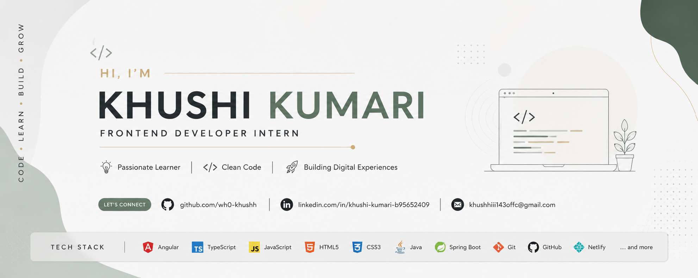

  

<h1 align="center">Hi, I'm Khushi Kumari 👋</h1>

<h3 align="center">
Frontend Developer Intern • Angular • TypeScript • Product Engineering • UI/UX Enthusiast
</h3>

Building thoughtful digital products with modern frontend technologies, clean architecture, and user-centered design.

---

## 👩‍💻 About Me

I'm a **Frontend Developer Intern** and **B.Tech Computer Science Engineering student** passionate about building modern, responsive, and intuitive web applications.

I enjoy transforming ideas into polished digital products by combining **clean engineering**, **thoughtful UI/UX**, and **scalable frontend architecture**.

During my internship at **WorkSeer**, I've contributed to enterprise Angular applications by building reusable components, developing reactive forms, integrating REST APIs, implementing authentication workflows, and improving responsive user interfaces.

Outside of work, I love experimenting with premium interfaces, design systems, animations, and modern frontend architecture while continuously learning how great products are built.

---

## 🚀 Current Focus

- ⚡ Advanced Angular Architecture
- ⚡ Product Engineering
- ⚡ UI/UX Design
- ⚡ Design Systems
- ⚡ RxJS & State Management
- ⚡ Authentication & Route Guards
- ⚡ REST API Integration
- ⚡ Building Production-Inspired Applications

---

# 🛠 Tech Stack

## Frontend

---

## Angular

- Angular
- Angular Material
- Angular Router
- RxJS
- Reactive Forms
- Dependency Injection
- HTTP Client
- Route Guards
- Lazy Loading
- JWT Authentication
- REST API Integration
- Component-Based Architecture
- Reusable Components
- State Management

---

## UI / UX

- Responsive UI
- Responsive Layouts
- UI Design
- UX Design
- Design Systems
- Microinteractions
- Accessibility (WCAG)
- Web Performance
- GSAP Animations

---

## Backend (Currently Learning)

- Java
- Spring Boot
- SQL
- RESTful APIs

---

# 🌟 Featured Projects

## 🏨 Aurelia Reserve

Luxury Resort Landing Page built with **Angular 14** featuring

- Responsive Design
- Component-Based Architecture
- Hero Slideshow
- Interactive Gallery
- Elegant UI
- Mobile Navigation
- Modern User Experience

🔗 **Live Demo**

https://aurelia-reserve.netlify.app

💻 **Repository**

https://github.com/wh0-khushh/aurelia-reserve

---

## 💼 Personal Portfolio

Modern Software Engineering Portfolio built using Angular.

Highlights

- Dark / Light Theme
- Responsive Design
- Experience Timeline
- Project Showcase
- Resume Download
- GitHub Integration
- Modern UI

---

## 🚀 Current Project

**GlassFlow**

An enterprise-inspired Angular SaaS application focused on authentication, reusable architecture, premium Glassmorphism UI, state management, REST APIs, and scalable frontend engineering.

> Currently under development.

---

# 📈 GitHub Stats

  
  
  
  
  

---

# 🌱 Currently Learning

- Advanced Angular Patterns
- Software Architecture
- Product Engineering
- Spring Boot Fundamentals
- System Design Fundamentals
- Building Better User Experiences

---

# 🎯 Career Goal

To grow as a **Frontend Engineer** who builds scalable, accessible, and beautifully crafted digital products that solve real-world problems.

---

# 🤝 Let's Connect

💼 **LinkedIn**

https://www.linkedin.com/in/khushi-kumari-b95652409

🌐 **Portfolio**

(https://khushi-kumariportfolio.netlify.app/)

💻 **GitHub**

https://github.com/wh0-khushh

📧 **Email**

khushhiii143offc@gmail.com

---

# 💭 Favorite Quote

> *"Great software isn't just functional—it should feel effortless to use."*

---

Thanks for stopping by! 😊

I'm always learning, building, and improving one project at a time.

⭐ If you like my work, feel free to explore my repositories.

