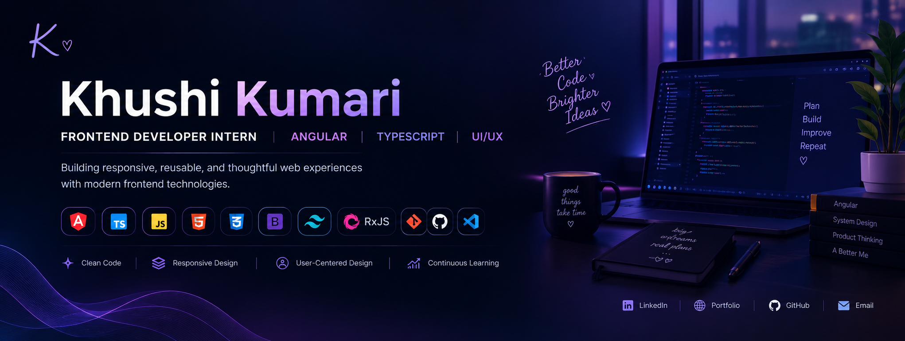

<p align="center">
  
</p>

<h1 align="center">Hi, I'm Khushi Kumari 👋</h1>

<p align="center">
  <strong>Frontend Developer Intern • Angular • TypeScript • UI/UX</strong>
</p>

<p align="center">
  Building responsive, reusable, and thoughtful web experiences with modern frontend technologies.
</p>

<p align="center">
  <a href="https://www.linkedin.com/in/khushi-kumari-b95652409">LinkedIn</a>
  •
  <a href="https://khushi-kumariportfolio.netlify.app/">Portfolio</a>
  •
  <a href="https://github.com/wh0-khushh">GitHub</a>
</p>

---

# 👩‍💻 About Me

I'm a **Frontend Developer Intern** and **B.Tech Computer Science Engineering student** focused on building modern, responsive, and user-friendly web applications.

My primary development focus is **Angular, TypeScript, JavaScript, HTML5, CSS3, Angular Material, RxJS, and responsive UI development**.

At **WorkSeer**, I contribute to enterprise web applications, working with Angular-based interfaces, reusable components, Reactive Forms, client-side validation, REST API integration, and responsive UI development.

Alongside frontend engineering, I'm expanding my knowledge of **Java, Spring Boot, REST APIs, software architecture, and backend development** as I work toward becoming a stronger full-stack software engineer.

I also enjoy exploring **UI systems, design, responsive layouts, and frontend architecture** through personal projects.

---

# 🚀 What I'm Focused On

- Angular & TypeScript
- Reusable Component Architecture
- Responsive Frontend Development
- Angular Material & RxJS
- Reactive Forms & Validation
- REST API Integration
- Frontend Engineering Practices
- UI / UX Design
- Java & Spring Boot
- Software Architecture

---

# 🛠 Tech Stack

### Frontend

<p>
  
</p>

**Angular • TypeScript • JavaScript • HTML5 • CSS3 • Angular Material • RxJS • Responsive Design**

### Backend & APIs

<p>
  
</p>

**Java • Spring Boot • REST APIs • SQL**

> Currently strengthening my backend and full-stack development skills.

### Tools & Platforms

<p>
  
</p>

**Git • GitHub • VS Code • Postman • Figma • Netlify**

---

# 🌟 Featured Project

## 🏨 Aurelia Reserve

**Luxury Resort Landing Page**

A responsive luxury resort landing page built with **Angular 14 and TypeScript**, focused on polished visual design, reusable components, responsive layouts, and an engaging browsing experience.

### Highlights

- Responsive desktop, tablet & mobile layouts
- Reusable Angular components
- Responsive navigation
- Hero slideshow
- Interactive image gallery
- Mobile navigation
- Modern UI design
- Netlify deployment

### Tech Used

`Angular 14` `TypeScript` `JavaScript` `HTML5` `CSS3` `Git` `Netlify`

<p>
  🔗 <a href="https://aurelia-reserve.netlify.app/">Live Demo</a>
  &nbsp; • &nbsp;
  💻 <a href="https://github.com/wh0-khushh/aurelia-reserve">Source Code</a>
</p>

---

# 💼 Professional Experience

### Frontend Developer Intern — WorkSeer

**July 2025 — Present**

Contributing to enterprise web applications for a cloud-based Global Trade Management platform.

### Areas of Contribution

- Angular frontend development
- Responsive user interfaces
- Reusable Angular components
- Angular Material
- Reactive Forms
- Client-side validation
- REST API integration
- Git & GitHub
- Enterprise application workflows

Alongside frontend development, I'm gaining exposure to **Java, Spring Boot, REST APIs, PostgreSQL, cloud technologies, microservices, and modern software development practices**.

---

# 🌱 Currently Learning

```text
Angular
   ↓
Java
   ↓
Spring Boot
   ↓
REST APIs
   ↓
SQL / PostgreSQL
   ↓
Full-Stack Development
